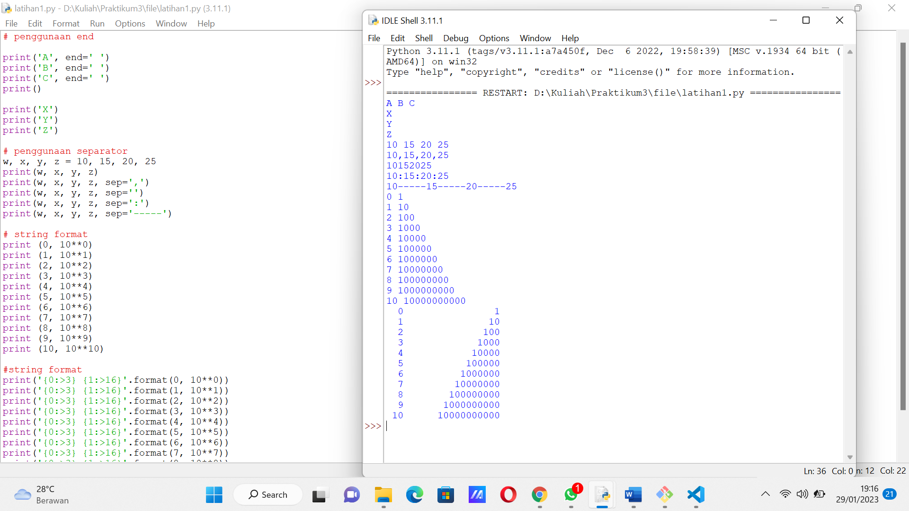

# Praktikum3
## Tugas bahasa pemrograman
### Beberapa latihan program bahasa python

1. Latihan 1 
- end berfungsi untuk mengganti karakter terakhir bawaan yang dicetak di layar. Jadi setiap kali kita memanggil fungsi 'print()' untuk mencetak sesuatu, maka python akan mencetak karakter ganti baris () di setiap output,
- separator adalah komponen yang menentukan pemisah yang akan digunakan saat memisahkan string.
- string formatting memungkinkan kita menyuntikkan item ke dalam string daripada kita mencoba menggabungkan string menggunakan koma.
2. Latihan 2 
- Melakukan output dengan menggunakan output formatting
3. Latihan 3 
- Menggunakan string formatting untuk membuat pola diamond