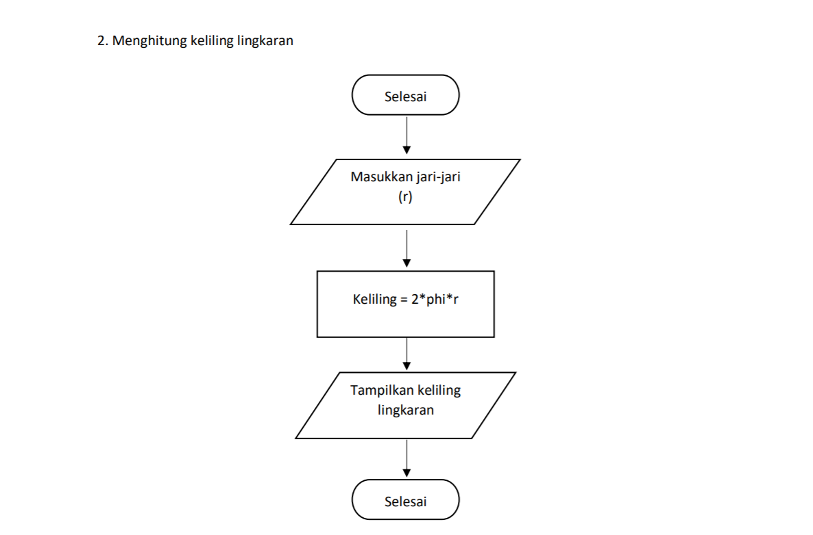

# Praktikum3
## Tugas bahasa pemrograman
### Beberapa latihan program bahasa python

1. Latihan 1 
- end berfungsi untuk mengganti karakter terakhir bawaan yang dicetak di layar. Jadi setiap kali kita memanggil fungsi 'print()' untuk mencetak sesuatu, maka python akan mencetak karakter ganti baris () di setiap output,
- separator adalah komponen yang menentukan pemisah yang akan digunakan saat memisahkan string.
- string formatting memungkinkan kita menyuntikkan item ke dalam string daripada kita mencoba menggabungkan string menggunakan koma.
2. Latihan 2 
- Melakukan output dengan menggunakan output formatting
3. Latihan 3 
- Menggunakan string formatting untuk membuat pola diamond
4. Latihan 4 membuat program untuk menghitung luas lingkaran 
- mendeklarasikan phi dengan nilai 3.14
- mendeklarasikan variable r serta memasukkan nilai jari-jari lingkaran bertipe data float
- mendeklarasikan variable luas dimana nilai variable tersebut didapat dari perhitungan phi*r*r
-menampilkan nilai dari variable luas
5. Latihan 5 membuat program untuk menghitung keliling lingkaran 
- mendeklarasikan phi dengan nilain 3.14
mendeklarasikan r serta memasukkan nilai jari-jari lingkaran bertipe data float
- mendeklarasikan k dimana nilai variable tersebut didapat dari perhitungan 2*phi*r
- menampilkan keliling lingkaran
6. Flowchart menghitung luas dan keliling lingkaran  